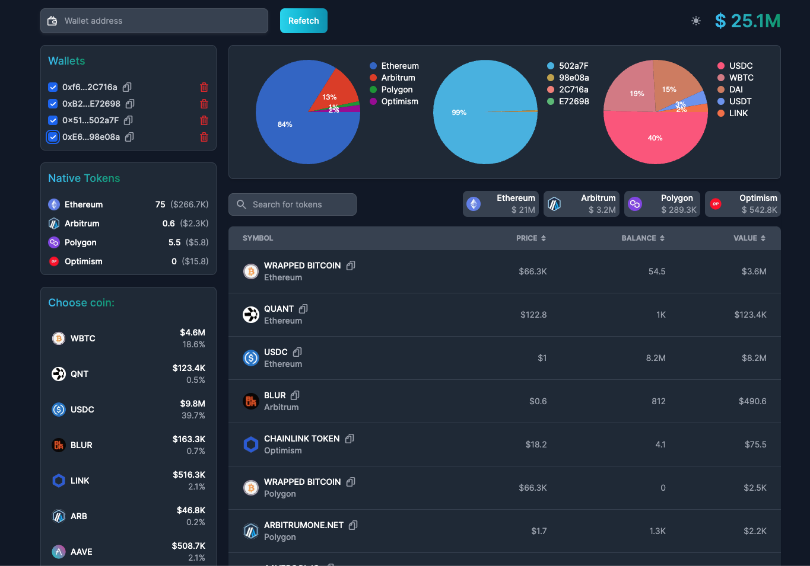
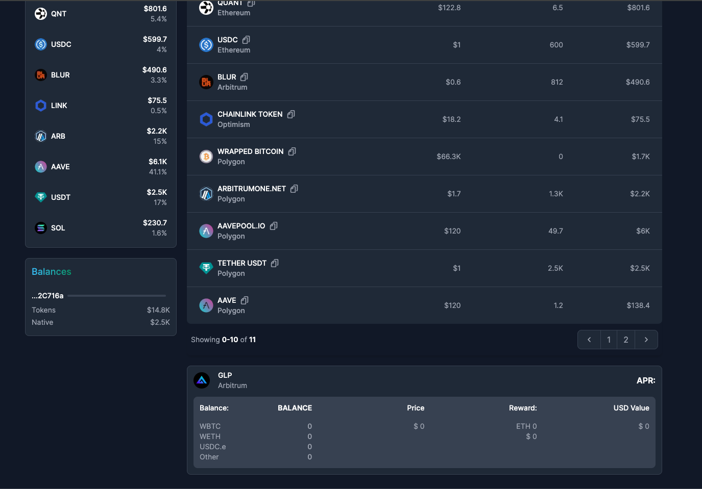

<h1>Crypto Dashboard</h1>

The Crypto Dashboard is a web application designed to provide users with a comprehensive overview of their cryptocurrency assets across multiple blockchain networks. Users can seamlessly manage and track their portfolios by adding multiple wallet addresses and gaining insights into their ERC20 tokens, native tokens, and liquidity pools.

 

   &nbsp;&nbsp;&nbsp;&nbsp;&nbsp;

  Technologies used: NextJS, tailwindCss

